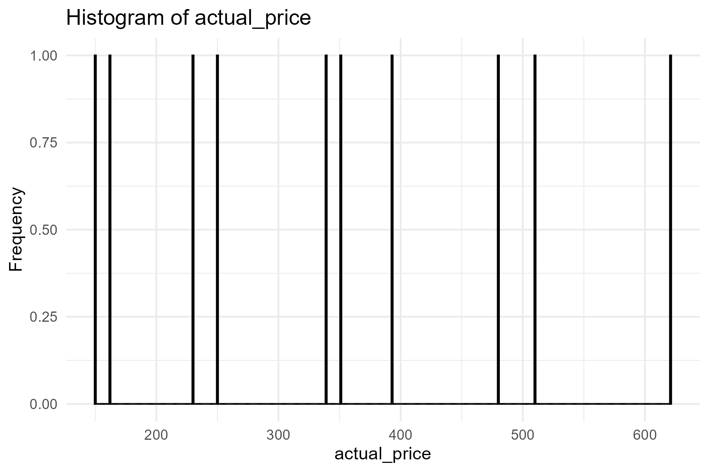
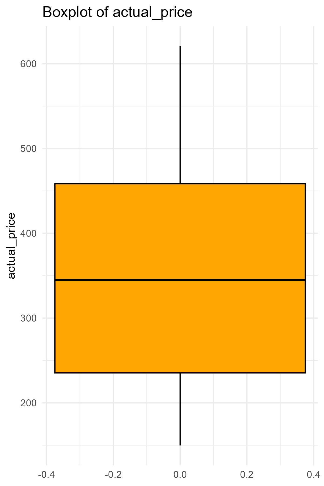
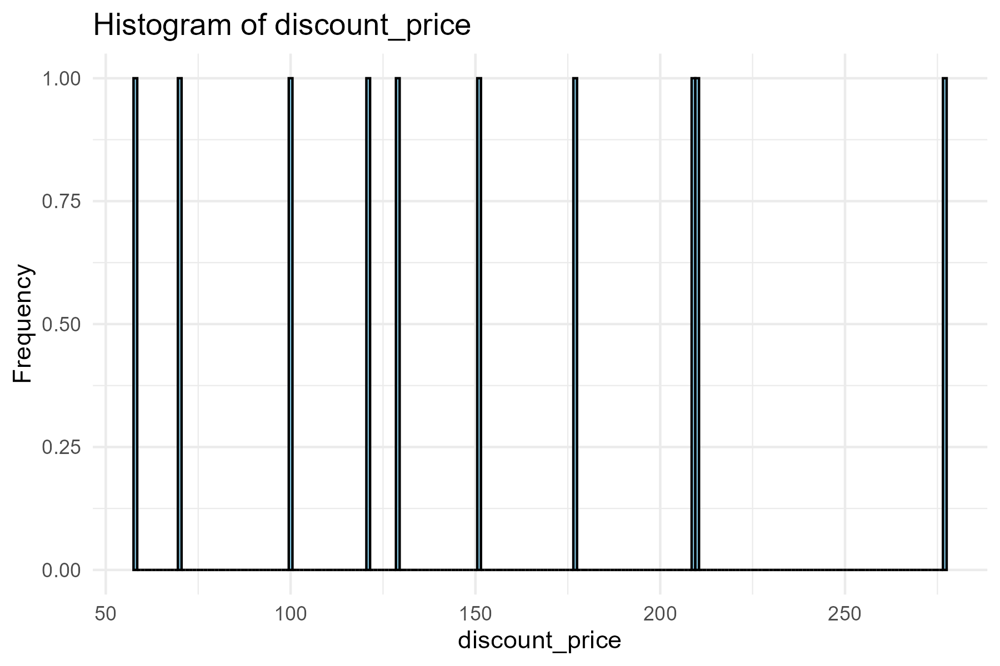
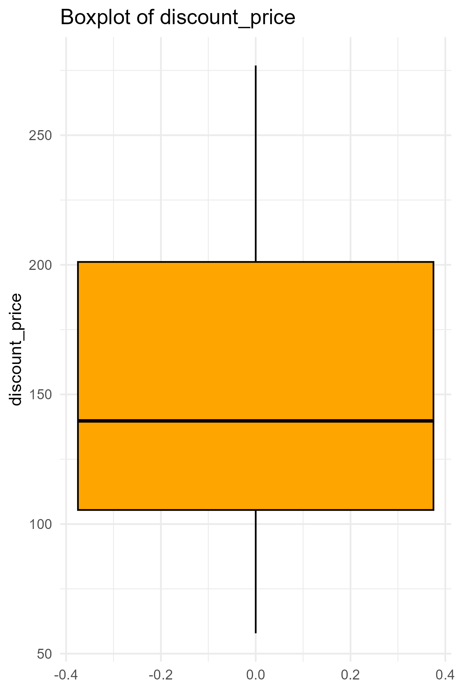
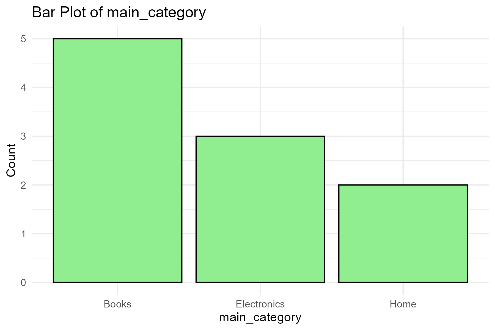
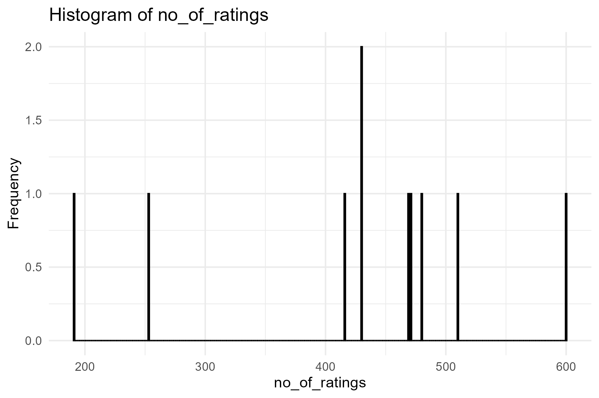
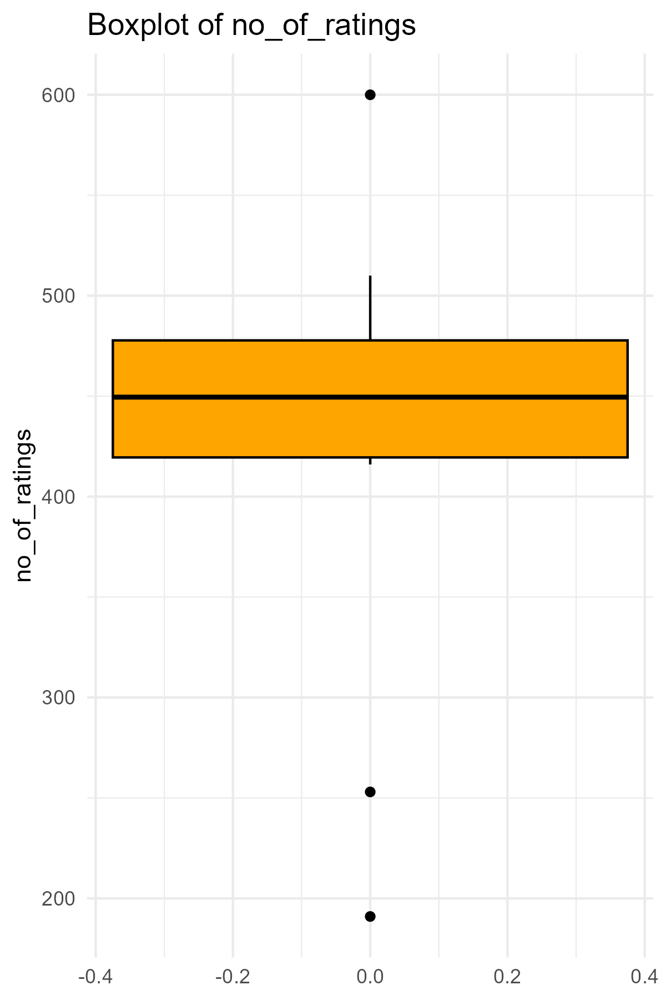
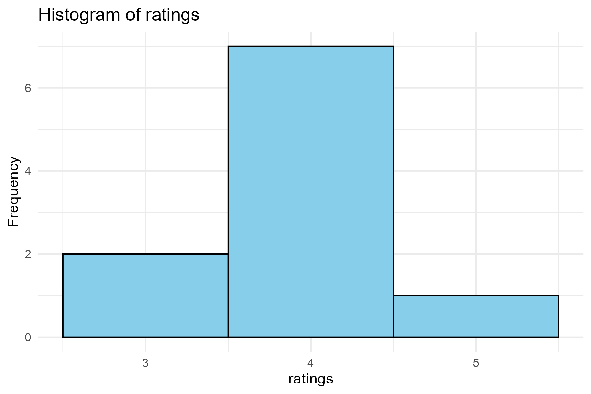
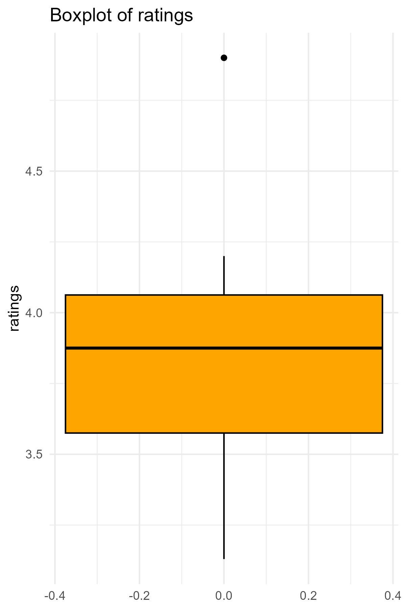
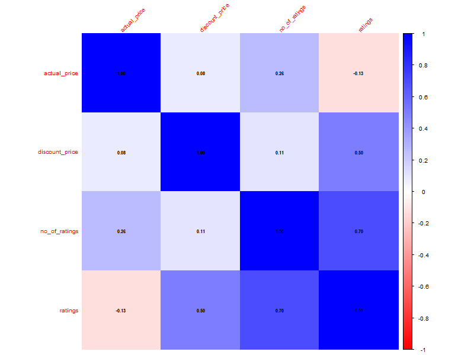

# Overview

## Dataset Statistics
| Statistic | Value |
|------|------|
| Number of Variables |    5.0 |
| Number of Observations |   10.0 |
| Missing Cells |    0.0 |
| Missing Cells (%) |    0.0 |
| Duplicate Rows |    0.0 |
| Duplicate Rows (%) |    0.0 |
| Total Size in Memory (bytes) | 2072.0 |
| Average Record Size (bytes) |  207.2 |

## Variable Types
Numeric: 4  
Categorical: 0  
Text: 1  
| Variable | Type |
|------|------|
| actual_price | numeric |
| discount_price | numeric |
| main_category | character |
| no_of_ratings | numeric |
| ratings | numeric |

# Variables

###  actual_price 
| Statistic | Value |
|------|------|
| Number of Distinct Values | 10 |
| Percent Distinct Values | 100 |
| Missing Values | 0 |
| Percent Missing Values | 0 |
| Infinite Values | 0 |
| Percent Infinite Values | 0 |
| Mean | 348.658 |
| Median | 345.055 |
| Mode | 149.8 |
| Standard Deviation | 155.4434 |
| Variance | 24162.64 |
| Minimum | 149.8 |
| Maximum | 620.8 |
| Zeros | 0 |
| Percent Zeros | 0 |
| Negative Values | 0 |
| Percent Negative Values | 0 |
| Total Size in Memory (bytes) | 176 |

#### Histogram

#### Boxplot

###  discount_price 
| Statistic | Value |
|------|------|
| Number of Distinct Values | 10 |
| Percent Distinct Values | 100 |
| Missing Values | 0 |
| Percent Missing Values | 0 |
| Infinite Values | 0 |
| Percent Infinite Values | 0 |
| Mean | 150.202 |
| Median | 139.79 |
| Mode | 57.86 |
| Standard Deviation | 68.85601 |
| Variance | 4741.15 |
| Minimum | 57.86 |
| Maximum | 276.89 |
| Zeros | 0 |
| Percent Zeros | 0 |
| Negative Values | 0 |
| Percent Negative Values | 0 |
| Total Size in Memory (bytes) | 176 |

#### Histogram

#### Boxplot

###  main_category 
| Statistic | Value |
|------|------|
| Number of Distinct Values |   3 |
| Percent Distinct Values |  30 |
| Missing Values |   0 |
| Percent Missing Values |   0 |
| Total Size in Memory (bytes) | 352 |

#### Bar Plot

###  no_of_ratings 
| Statistic | Value |
|------|------|
| Number of Distinct Values | 9 |
| Percent Distinct Values | 90 |
| Missing Values | 0 |
| Percent Missing Values | 0 |
| Infinite Values | 0 |
| Percent Infinite Values | 0 |
| Mean | 425 |
| Median | 449.5 |
| Mode | 430 |
| Standard Deviation | 119.9064 |
| Variance | 14377.56 |
| Minimum | 191 |
| Maximum | 600 |
| Zeros | 0 |
| Percent Zeros | 0 |
| Negative Values | 0 |
| Percent Negative Values | 0 |
| Total Size in Memory (bytes) | 176 |

#### Histogram

#### Boxplot

###  ratings 
| Statistic | Value |
|------|------|
| Number of Distinct Values | 10 |
| Percent Distinct Values | 100 |
| Missing Values | 0 |
| Percent Missing Values | 0 |
| Infinite Values | 0 |
| Percent Infinite Values | 0 |
| Mean | 3.839 |
| Median | 3.875 |
| Mode | 3.13 |
| Standard Deviation | 0.5188973 |
| Variance | 0.2692544 |
| Minimum | 3.13 |
| Maximum | 4.9 |
| Zeros | 0 |
| Percent Zeros | 0 |
| Negative Values | 0 |
| Percent Negative Values | 0 |
| Total Size in Memory (bytes) | 176 |

#### Histogram

#### Boxplot

# Correlations

#### Correlation Heatmap

