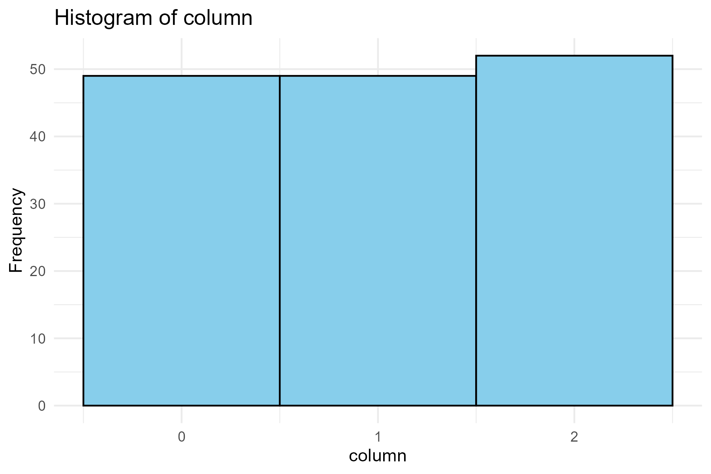
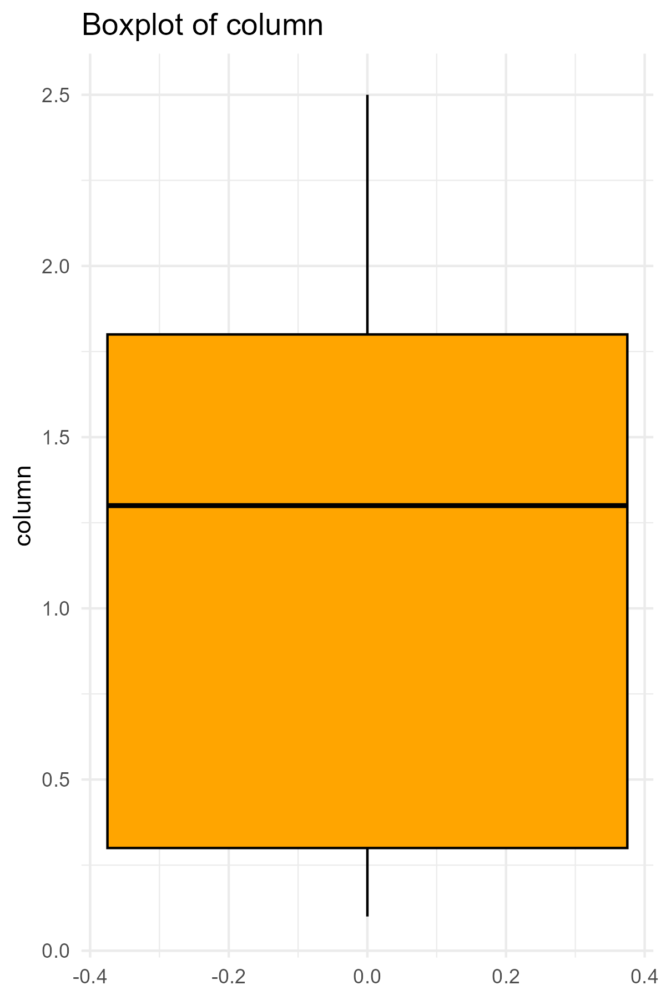
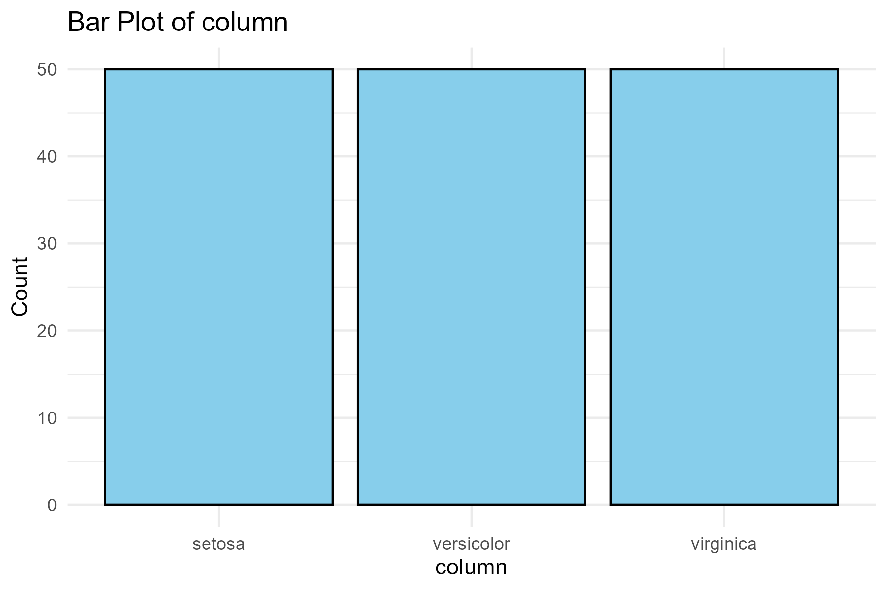

# Overview

## Dataset Statistics
| Statistic | Value |
|------|------|
| Number of Variables |    5.0000000 |
| Number of Observations |  150.0000000 |
| Missing Cells |    0.0000000 |
| Missing Cells (%) |    0.0000000 |
| Duplicate Rows |    1.0000000 |
| Duplicate Rows (%) |    0.6666667 |
| Total Size in Memory (bytes) | 7256.0000000 |
| Average Record Size (bytes) |   48.3733333 |

## Variable Types
Numeric: 4  
Categorical: 1  
Text: 0  
| Variable | Type |
|------|------|
| Sepal.Length | numeric |
| Sepal.Width | numeric |
| Petal.Length | numeric |
| Petal.Width | numeric |
| Species | factor |

# Variables

###  Sepal.Length 
| Statistic | Value |
|------|------|
| Number of Distinct Values | 35 |
| Percent Distinct Values | 23.33333 |
| Missing Values | 0 |
| Percent Missing Values | 0 |
| Infinite Values | 0 |
| Percent Infinite Values | 0 |
| Mean | 5.843333 |
| Median | 5.8 |
| Mode | 5 |
| Standard Deviation | 0.8280661 |
| Variance | 0.6856935 |
| Minimum | 4.3 |
| Maximum | 7.9 |
| Zeros | 0 |
| Percent Zeros | 0 |
| Negative Values | 0 |
| Percent Negative Values | 0 |
| Total Size in Memory (bytes) | 1248 |

#### Histogram

#### Boxplot

###  Sepal.Width 
| Statistic | Value |
|------|------|
| Number of Distinct Values | 23 |
| Percent Distinct Values | 15.33333 |
| Missing Values | 0 |
| Percent Missing Values | 0 |
| Infinite Values | 0 |
| Percent Infinite Values | 0 |
| Mean | 3.057333 |
| Median | 3 |
| Mode | 3 |
| Standard Deviation | 0.4358663 |
| Variance | 0.1899794 |
| Minimum | 2 |
| Maximum | 4.4 |
| Zeros | 0 |
| Percent Zeros | 0 |
| Negative Values | 0 |
| Percent Negative Values | 0 |
| Total Size in Memory (bytes) | 1248 |

#### Histogram

#### Boxplot

###  Petal.Length 
| Statistic | Value |
|------|------|
| Number of Distinct Values | 43 |
| Percent Distinct Values | 28.66667 |
| Missing Values | 0 |
| Percent Missing Values | 0 |
| Infinite Values | 0 |
| Percent Infinite Values | 0 |
| Mean | 3.758 |
| Median | 4.35 |
| Mode | 1.4 |
| Standard Deviation | 1.765298 |
| Variance | 3.116278 |
| Minimum | 1 |
| Maximum | 6.9 |
| Zeros | 0 |
| Percent Zeros | 0 |
| Negative Values | 0 |
| Percent Negative Values | 0 |
| Total Size in Memory (bytes) | 1248 |

#### Histogram

#### Boxplot

###  Petal.Width 
| Statistic | Value |
|------|------|
| Number of Distinct Values | 22 |
| Percent Distinct Values | 14.66667 |
| Missing Values | 0 |
| Percent Missing Values | 0 |
| Infinite Values | 0 |
| Percent Infinite Values | 0 |
| Mean | 1.199333 |
| Median | 1.3 |
| Mode | 0.2 |
| Standard Deviation | 0.7622377 |
| Variance | 0.5810063 |
| Minimum | 0.1 |
| Maximum | 2.5 |
| Zeros | 0 |
| Percent Zeros | 0 |
| Negative Values | 0 |
| Percent Negative Values | 0 |
| Total Size in Memory (bytes) | 1248 |

#### Histogram

#### Boxplot

###  Species 
| Statistic | Value |
|------|------|
| Number of Distinct Values |    3 |
| Percent Distinct Values |    2 |
| Missing Values |    0 |
| Percent Missing Values |    0 |
| Total Size in Memory (bytes) | 1248 |

#### Bar Plot

# Correlations

#### Correlation Heatmap

